<div align="center">

# ORG

### Visual Workflow Automation, Built From the Ground Up

[](LICENSE)
[](https://go.dev/)
[](https://react.dev/)
[](https://www.postgresql.org/)
[](https://redis.io/)
[](https://www.docker.com/)
[](https://shinasorg.duckdns.org)

</div>

---

## Overview

**ORG** is a full-stack workflow automation platform that lets users visually design, deploy, and monitor automated workflows using a drag-and-drop node editor. Inspired by tools like Zapier and n8n, ORG was designed and built entirely from scratch — from the workflow engine and gRPC microservices to the real-time execution pipeline — rather than assembled from existing frameworks.

At its core, ORG solves a simple problem: repetitive, multi-step tasks shouldn't require custom code. Users connect triggers and actions — webhooks, schedules, conditions, delays, emails, and AI-powered nodes — into visual workflows that run reliably in production, with live execution logs and monitoring at every step.

ORG is built for developers, automation engineers, and technical teams who need a self-hosted, transparent alternative to closed automation platforms, and for anyone evaluating production-grade system design, microservices architecture, and real-time execution engines.

## Key Highlights

- 🛠️ Built entirely from scratch by a single developer
- 🧩 Production-style microservices architecture
- ⚡ Real-time workflow execution engine
- 📨 Redis-backed asynchronous processing
- 🔗 gRPC communication between services
- 💳 Stripe subscription billing
- 🔐 Google OAuth authentication
- 🤖 AI-powered workflow nodes using Google Gemini
- ⏱️ Cron-based scheduling
- 📊 Live execution monitoring
- 🐳 Dockerized deployment
- ☁️ AWS hosted

## Live Demo

**[shinasorg.duckdns.org](https://shinasorg.duckdns.org)**

Deployed via Docker on an AWS EC2 instance, served behind Nginx.

## Built With

**Frontend** — React · React Flow · Vite · Tailwind CSS
**Backend** — Golang · Gin · gRPC Microservices
**Database** — PostgreSQL
**Queue & Cache** — Redis
**Auth** — JWT · Google OAuth
**Payments** — Stripe
**Infrastructure** — Docker · Docker Compose · Nginx · AWS EC2
**Other** — Server-Sent Events (SSE) · REST APIs

---


## 📸 Dashboard

<p align="center">
  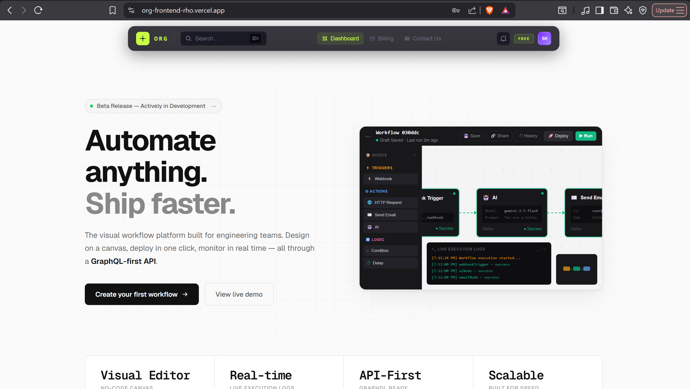
</p>

The dashboard provides an overview of workflows, recent executions, and platform statistics.

---

## 🎨 Workflow Builder

<p align="center">
  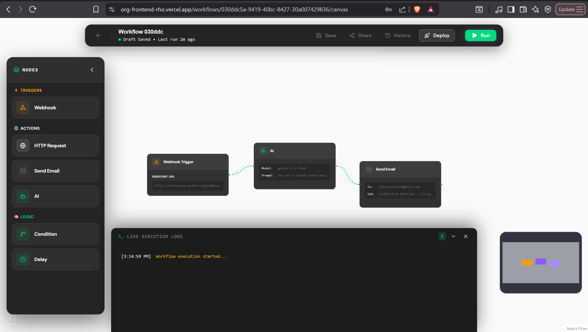
</p>

Create automation workflows visually using the drag-and-drop editor.

---

## 📊 Run History

<p align="center">
  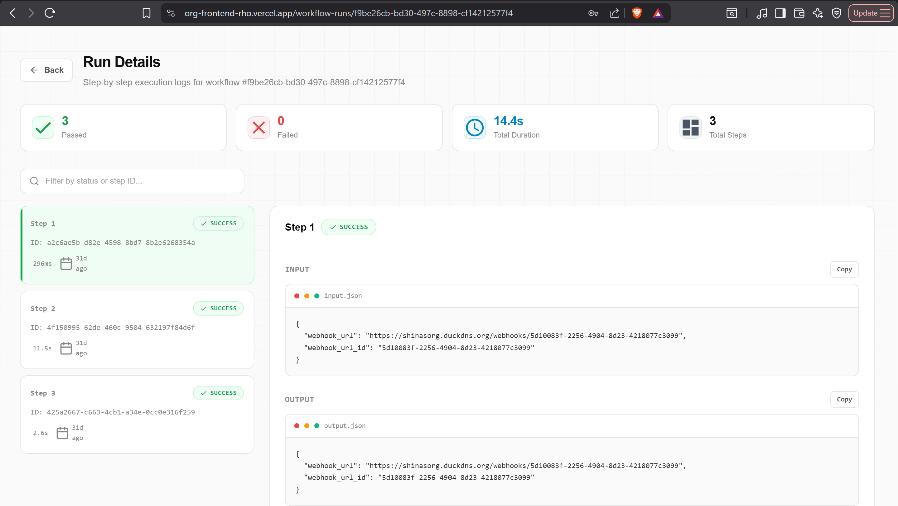
</p>

Monitor every workflow execution in real time.

---

## 👤 User Profile

<p align="center">
  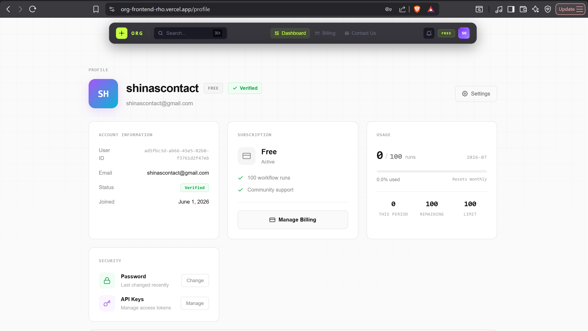
</p>

Manage account settings and connected services.

---

## 🔐 Authentication

<p align="center">
  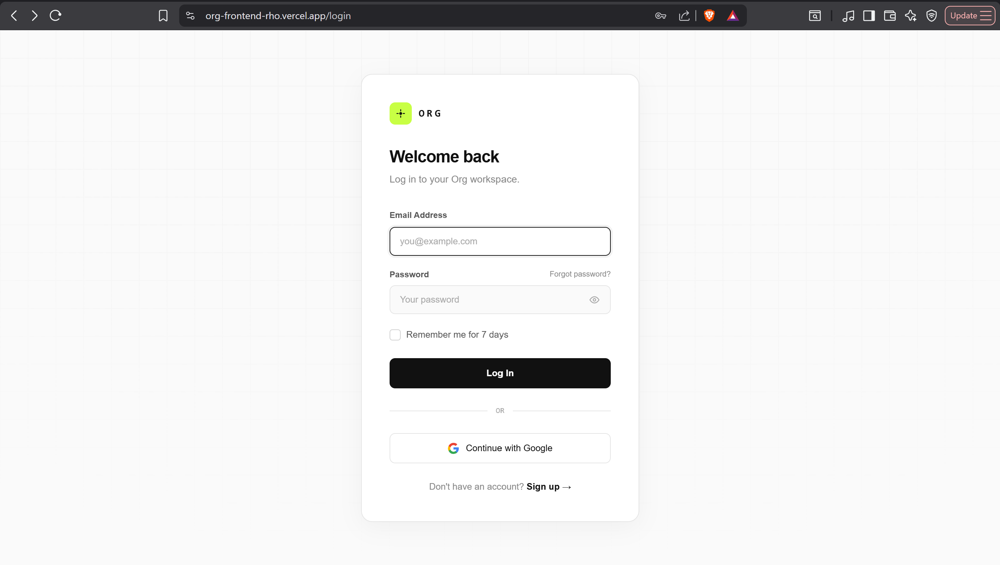
</p>

Secure authentication using JWT and Google OAuth.`


## Features

ORG provides a full pipeline for building, running, and operating automated workflows — from visual design to execution and monitoring. Each capability is backed by a dedicated service, following the same separation of concerns found in production automation systems.

---

### 🎨 Visual Workflow Builder

- **Drag-and-Drop Editor** — Compose workflows by placing and connecting nodes on a canvas, without writing code.
- **React Flow Canvas** — Built on React Flow for smooth panning, zooming, and node manipulation at scale.
- **Node Connections** — Define data and control flow between nodes through typed, directional edges.
- **Interactive Design** — Configure node parameters inline as the workflow is built, with immediate visual feedback.
- **Automatic Validation** — Detects disconnected nodes, missing configuration, and invalid graphs before execution.
- **Workflow Publishing** — Save workflows as drafts or publish them to make them active and executable.

---

### ⚡ Workflow Execution

- **DAG-Based Execution Engine** — Workflows are modeled as directed acyclic graphs, ensuring deterministic execution order.
- **Topological Execution** — Nodes execute in dependency order, guaranteeing upstream data is available before downstream nodes run.
- **Parallel Node Execution** — Independent branches execute concurrently, reducing overall workflow runtime.
- **Retry Handling** — Failed nodes can be retried based on configurable policies, improving resilience against transient errors.
- **Execution State Management** — Tracks the state of every node and workflow run throughout its lifecycle.
- **Persistent Workflow Runs** — Execution data is stored durably, allowing runs to be inspected after completion.

---

### 🔌 Triggers & Actions

**Triggers**
- **Webhook Trigger** — Starts a workflow when an HTTP request is received at a generated endpoint.
- **Cron Trigger** — Starts a workflow on a fixed schedule using standard cron expressions.

**Actions**
- **HTTP Request** — Calls external APIs and passes their responses into the workflow.
- **AI (Google Gemini)** — Executes AI-powered steps such as text generation or data transformation.
- **Send Email** — Delivers email notifications or reports as part of a workflow.
- **Delay** — Pauses execution for a defined duration before continuing.
- **Condition** — Branches workflow execution based on evaluated logic.
- **Variable Passing** — Passes output data between connected nodes for use in later steps.

The node system is designed to be extensible, allowing additional trigger and action types to be added over time.

---

### 📊 Monitoring & Execution Logs

- **Live Execution Logs** — Streams execution output in real time as a workflow runs.
- **Server-Sent Events (SSE)** — Pushes execution updates to the client without polling.
- **Execution History** — Retains a record of past workflow runs for review and debugging.
- **Workflow Status** — Reports the current state of a workflow: idle, running, completed, or failed.
- **Node-Level Execution Tracking** — Captures the input, output, and status of each individual node.
- **Error Reporting** — Surfaces node and workflow failures with contextual error details.

---

### 🔐 Authentication & Security

- **JWT Authentication** — Secures API access using signed, stateless tokens.
- **Google OAuth Login** — Allows users to authenticate using their existing Google account.
- **Secure API Endpoints** — Enforces authentication and authorization on all sensitive routes.
- **Protected Workflows** — Restricts workflow access and execution to authorized users.

---

### 💳 Billing

- **Stripe Checkout** — Handles subscription payments through Stripe's hosted checkout flow.
- **Free & Pro Plans** — Supports tiered access, gating features and limits based on plan.
- **Subscription Management** — Tracks subscription state and syncs it with user accounts.

---

### ⚙️ Scheduling

- **Cron Scheduling** — Defines recurring workflow execution using cron syntax.
- **Automatic Execution** — Triggers workflows without manual intervention once scheduled.
- **Next-Run Calculation** — Computes upcoming execution times based on each schedule.
- **Scheduler Service** — A dedicated service responsible for dispatching scheduled workflow runs.

---

### 🚀 Infrastructure

- **Dockerized Services** — All components run as containers for consistent, reproducible deployments.
- **Microservices Architecture** — Functionality is split across independently deployable services.
- **gRPC Communication** — Services communicate over gRPC for efficient, strongly-typed inter-service calls.
- **Redis-Backed Queues** — Handles asynchronous task processing and job distribution.
- **PostgreSQL Persistence** — Stores workflows, execution data, and user information.
- **Nginx Reverse Proxy** — Routes and terminates incoming traffic to backend services.
- **AWS Deployment** — Runs on AWS EC2 as the target production environment.


## System Architecture

ORG follows a microservices architecture that separates workflow authoring, execution, scheduling, and billing into independently deployable services. This separation keeps the execution path lightweight and allows each service to scale or fail independently of the others.

### Components

**Frontend**
The frontend is a React single-page application responsible for authentication flows, the dashboard, the drag-and-drop workflow builder (built on React Flow), execution monitoring views, schedule management, and billing screens. It communicates with the backend exclusively through the API Service.

**API Service**
The API Service is the single entry point for all client traffic. It exposes REST endpoints for authentication, workflow CRUD operations, workflow deployment, execution requests, and scheduler management. It validates and authorizes each request before delegating work to internal services over gRPC.

**Workflow Execution Engine**
The Execution Engine is responsible for running deployed workflows. On receiving an execution request, it loads the corresponding workflow definition from PostgreSQL and constructs a directed acyclic graph (DAG) from its nodes and edges. Nodes are executed in topological order, with independent branches run concurrently. The engine maintains in-memory state for each active run, tracking per-node status, inputs, and outputs, and persists execution history back to PostgreSQL as the run progresses. On completion (success or failure), the engine finalizes the run state and emits execution updates for downstream consumers.

**Node Execution**
Each node type encapsulates a single unit of work within a workflow:
- **Trigger Nodes** — initiate a workflow run (webhook or cron-based).
- **HTTP Nodes** — perform outbound HTTP requests and pass responses downstream.
- **AI Nodes** — invoke Google Gemini for text generation or data transformation steps.
- **Delay Nodes** — pause execution for a configured duration before continuing.
- **Condition Nodes** — evaluate expressions and branch execution accordingly.
- **Email Nodes** — send email notifications as part of a workflow.

Node execution is isolated per node, allowing retries and failures to be handled without affecting unrelated branches of the graph.

**Scheduler**
The Scheduler service manages all cron-based triggers. It parses cron expressions, computes the next run time for each scheduled workflow, and dispatches execution requests to the Workflow Execution Engine when a schedule becomes due. It runs independently of the API Service so that scheduled dispatch is not affected by API load.

**Redis**
Redis acts as the queueing and coordination layer between services. It buffers execution requests for asynchronous processing, holds short-lived execution state, and decouples the API Service, Scheduler, and Execution Engine so they can operate without direct synchronous dependencies on one another.

**PostgreSQL**
PostgreSQL is the system of record for all persistent data, including users, workflow definitions, nodes, edges, execution history, schedules, and billing metadata. All services read from and write to PostgreSQL through their respective data-access layers.

**Billing Service**
The Billing Service manages subscription state. It initiates Stripe Checkout sessions, processes subscription lifecycle events, and synchronizes plan status with user accounts in PostgreSQL. The API Service consults this state to enforce plan-based limits and feature access.

### Communication

- **REST** is used between the frontend and the API Service.
- **gRPC** is used for internal communication between backend services (API Service, Execution Engine, Scheduler, Billing Service).
- **Server-Sent Events (SSE)** are used to stream live execution logs and status updates from the backend to the frontend without polling.

### Architecture Diagram

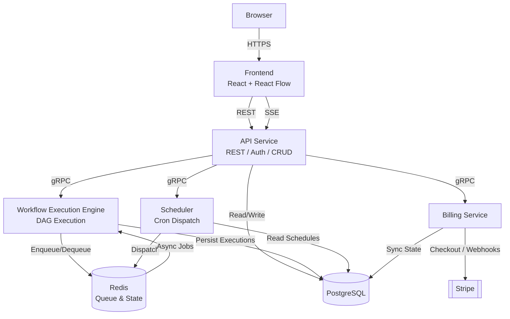

## Workflow Execution Engine

The Workflow Execution Engine is the component responsible for running deployed workflows. It is designed as a stateless, horizontally scalable service that consumes execution requests, resolves the workflow graph, executes nodes in dependency order, and persists the outcome of every run.

### Execution Flow

**1. Workflow Trigger**
A workflow run can be initiated in one of three ways:
- **Webhook** — an inbound HTTP request to a workflow-specific endpoint.
- **Cron Schedule** — a scheduled dispatch from the Scheduler service when a cron expression becomes due.
- **Manual Execution** — a direct invocation requested by the user through the API Service.

Regardless of origin, every trigger is normalized into a single execution request before entering the engine.

**2. Workflow Loading**
On receiving an execution request, the engine:
- Fetches the workflow definition from PostgreSQL.
- Loads the associated nodes and their configuration.
- Loads the edges that define connections between nodes.
- Validates the workflow, rejecting graphs with missing configuration, disconnected nodes, or invalid references.
- Creates an execution context that scopes state, variables, and metadata to this specific run.

**3. Graph Construction**
Workflows are represented internally as Directed Acyclic Graphs (DAGs). Each node is a vertex, and each edge defines a directed dependency between a parent and its child. The engine builds this dependency graph from the loaded nodes and edges, determining which nodes have no upstream dependencies (root nodes) and which nodes must wait on one or more parents before they are eligible to run. This graph is the authoritative execution plan for the run.

**4. Node Scheduling**
Execution proceeds in topological order:
- Root nodes are scheduled first, as they have no unresolved dependencies.
- A downstream node is only scheduled once all of its parent nodes have completed successfully.
- Nodes that do not depend on one another are scheduled concurrently, allowing independent branches of the workflow to execute in parallel rather than sequentially.

**5. Node Execution**
Each node type performs a distinct, isolated unit of work:
- **Webhook Trigger** — captures the inbound request payload and makes it available as the initial workflow input.
- **Cron Trigger** — marks the start of a scheduled run; carries no external payload beyond schedule metadata.
- **HTTP Request** — issues an outbound call to an external endpoint and forwards the response to downstream nodes.
- **AI (Google Gemini)** — sends a prompt or data payload to Gemini and returns the generated output for use later in the workflow.
- **Condition** — evaluates a boolean expression against available context and determines which downstream branch, if any, should execute.
- **Delay** — suspends progression of its branch for a configured duration before allowing execution to continue.
- **Send Email** — dispatches an email using data assembled from the workflow context.

Each node executes independently of the others; a node has no knowledge of how its dependencies were computed, only the outputs they expose.

**6. Workflow Context**
As nodes complete, their outputs are written into a shared execution context scoped to the run. Downstream nodes read their required inputs from this context rather than from the nodes that produced them directly, keeping nodes decoupled from one another. Alongside node outputs, the context carries execution metadata — run identifiers, timestamps, and trigger data — that remains accessible throughout the lifecycle of the run.

**7. Execution State**
Every workflow run is tracked through an explicit state machine:

| State | Description |
|---|---|
| `Pending` | Run has been accepted but node execution has not started. |
| `Running` | One or more nodes are actively executing. |
| `Completed` | All nodes have finished successfully. |
| `Failed` | Execution halted due to an unrecoverable node failure. |
| `Cancelled` | Run was terminated before completion. |

Individual nodes carry their own state (`pending`, `running`, `completed`, `failed`), independent of the overall run state, allowing partial progress to be inspected even while a run is still in flight.

**8. Error Handling**
Node failures are captured at the node level and do not immediately terminate independent branches of the graph — only the failing branch is halted, while unrelated branches may continue or complete. If a failure occurs on a node required by the remainder of the graph, the workflow run transitions to `Failed`. All failures are logged with contextual detail, including the failing node, its inputs, and the resulting error. Where retry policies are configured, the engine re-attempts a failed node up to a defined limit before treating it as a terminal failure. Errors that cannot be resolved locally propagate upward, marking dependent nodes as unreachable rather than executing them against incomplete input.

**9. Execution History**
Once a run reaches a terminal state, its full record is persisted to PostgreSQL, including the start and end timestamps, the final status, total duration, and per-node logs capturing input, output, and status for every node in the graph. This history is retained independently of the live execution context, allowing completed runs to be reviewed after the fact.

### Execution Lifecycle

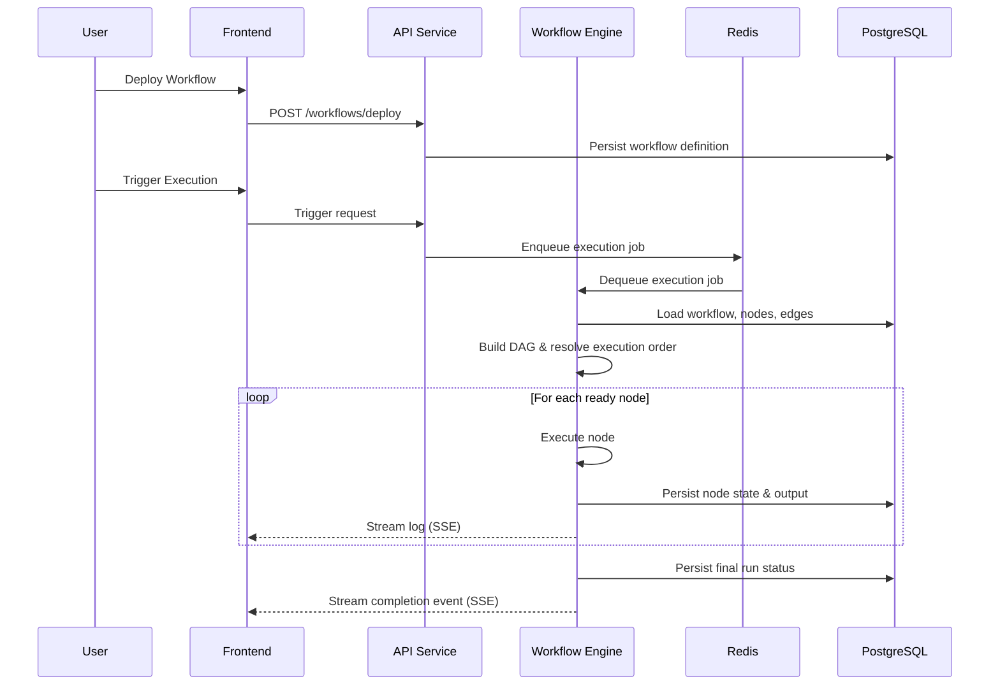

### Execution Design Principles

- **Deterministic Execution** — Given the same workflow definition and inputs, node execution order is fully determined by the DAG; there is no ambiguity in scheduling.
- **Fault Isolation** — A failure in one node or branch does not corrupt or block unrelated branches of the same run.
- **Stateless Services** — The engine holds no long-lived in-process state between requests; all durable state lives in PostgreSQL and Redis, allowing engine instances to be scaled horizontally.
- **Persistent Execution History** — Every run, successful or failed, is recorded durably, enabling post-hoc inspection and auditing.
- **Scalable Asynchronous Processing** — Execution requests are queued through Redis, decoupling trigger ingestion from execution throughput and allowing the system to absorb bursts of load.
- **Loose Coupling** — Services communicate through well-defined boundaries (queue, gRPC, shared context) rather than direct dependencies, allowing components to evolve independently.
- **Reliability** — Retry policies, explicit state tracking, and durable persistence ensure that transient failures do not silently corrupt workflow outcomes.


## Repository Structure

ORG is organized as a polyrepo. Rather than housing all services in a single repository, the platform is split across multiple GitHub repositories, each owning a distinct part of the system. This mirrors the microservices architecture described in the System Architecture section: each repository corresponds to a service boundary, with its own codebase, dependencies, and release lifecycle.

There are currently three repositories.

### `OrgFrontend`

The client-facing React application.

**Responsibilities**
- Authentication pages
- Dashboard
- Workflow Builder with React Flow integration
- Execution monitoring, including real-time logs via SSE
- Scheduling UI
- Billing UI
- User profile management
- Workflow management

**Technology:** React, React Flow, Vite, Tailwind CSS

### `Org`

The core backend service and workflow execution engine.

**Responsibilities**
- REST APIs
- Authentication (JWT, Google OAuth)
- Workflow CRUD
- Workflow deployment
- Workflow execution engine
- Scheduler
- Webhook processing
- AI node execution
- Email actions
- SSE streaming
- PostgreSQL access
- Redis integration
- gRPC client for communicating with the Billing Service

**Technology:** Golang, Gin, PostgreSQL, Redis, gRPC

### `org-billing-service`

The billing and subscription service.

**Responsibilities**
- Stripe Checkout
- Subscription management
- Webhook processing
- Billing APIs
- Plan validation
- gRPC server exposing billing operations to `Org`

**Technology:** Golang, Stripe, gRPC

### Repository Overview

| Repository | Responsibility | Technology |
|---|---|---|
| `OrgFrontend` | User interface, workflow builder, dashboards, billing UI | React, React Flow, Vite, Tailwind CSS |
| `Org` | Core backend, workflow execution engine, scheduler, APIs | Golang, Gin, PostgreSQL, Redis, gRPC |
| `org-billing-service` | Stripe billing, subscription management, plan validation | Golang, Stripe, gRPC |

### Why a Polyrepo Architecture?

ORG is split across multiple repositories to reflect the boundaries of its underlying services rather than to manage a single shared codebase. This organization provides:

- **Independent development** — each service can be worked on without touching unrelated code.
- **Clear service boundaries** — repository boundaries reinforce the same boundaries defined by the microservices architecture.
- **Independent deployments** — each repository is built and deployed on its own, without coordinating a release across the entire platform.
- **Smaller codebases** — each repository stays focused on a single service, keeping it easier to navigate and reason about.
- **Better maintainability** — changes to one service do not require reviewing or modifying unrelated services.
- **Separate release cycles** — the frontend, core backend, and billing service can each be versioned and released independently.
- **Microservice-oriented organization** — the repository layout mirrors the runtime architecture rather than abstracting it away.

### Repository Design Principles

The organization of ORG's repositories follows the same principles applied to its system design:

- **Separation of concerns** — each repository is scoped to a single service and its responsibilities.
- **Service ownership** — each repository owns its own data access, business logic, and API surface.
- **Loose coupling** — services communicate through well-defined interfaces (REST, gRPC) rather than shared code.
- **Modular architecture** — services can evolve independently as long as their interfaces remain stable.
- **Scalability** — services can be scaled independently based on their individual resource and traffic needs.
- **Maintainability** — smaller, focused repositories reduce the cognitive overhead of working on any single part of the system.
- **Production-oriented design** — the repository structure supports independent CI/CD pipelines and deployment processes for each service.


## Technology Stack

| Layer | Technology | Purpose | Why It Was Chosen |
|---|---|---|---|
| Frontend | React | Component-based UI for the dashboard, builder, and monitoring views. | Mature ecosystem, predictable component model, and broad compatibility with supporting libraries used elsewhere in the frontend. |
| Frontend | React Flow | Rendering and interaction layer for the drag-and-drop workflow builder. | Purpose-built for node-based editors; handles canvas panning, zooming, and edge routing without requiring a custom graph renderer. |
| Frontend | Vite | Build tooling and development server for the frontend application. | Fast cold starts and hot module replacement reduce iteration time compared to older bundler-based setups. |
| Frontend | Tailwind CSS | Styling for all frontend views. | Utility-first approach keeps styling co-located with markup and avoids maintaining a separate, growing CSS codebase. |
| Backend | Golang | Core language for the API service, execution engine, and scheduler. | Native concurrency primitives (goroutines, channels) map directly onto the concurrent, DAG-based execution model; compiles to a single static binary, simplifying deployment. |
| Backend | Gin | HTTP web framework for the API service. | Lightweight router with low overhead, minimal abstraction over the standard library, and sufficient middleware support for auth and validation. |
| Communication | REST APIs | Interface between the frontend and the API service. | Well understood by client tooling, straightforward to version, and sufficient for the request/response patterns used by the frontend. |
| Communication | gRPC | Communication between backend services (API, Execution Engine, Scheduler, Billing). | Strongly typed contracts via protobuf and low serialization overhead are better suited to internal service-to-service calls than REST. |
| Communication | Server-Sent Events (SSE) | Streaming live execution logs and status updates to the frontend. | One-directional server-to-client updates fit the log-streaming use case without the added complexity of a full duplex protocol such as WebSockets. |
| Database | PostgreSQL | System of record for users, workflows, nodes, edges, execution history, and billing metadata. | Strong support for relational integrity between workflows and their nodes/edges, combined with mature tooling for migrations and indexing. |
| Queue & Cache | Redis | Job queue between the API service and the Execution Engine, and short-lived execution state. | In-memory data structures provide low-latency enqueue/dequeue operations, decoupling trigger ingestion from execution throughput. |
| Authentication | JWT | Stateless authentication for API requests. | Avoids server-side session storage, allowing authentication checks to scale horizontally across API instances. |
| Authentication | Google OAuth | User login via existing Google accounts. | Removes the need to store and manage user passwords directly, reducing the platform's authentication attack surface. |
| Billing | Stripe | Subscription checkout and lifecycle management. | Handles PCI compliance, payment method storage, and subscription billing logic that would otherwise need to be built and maintained in-house. |
| Infrastructure | Docker | Containerization of all services. | Ensures each service runs identically across development and production environments, independent of host-level dependencies. |
| Infrastructure | Docker Compose | Local orchestration of multi-service setup. | Simplifies running the full microservices stack (API, Engine, Scheduler, Billing, Redis, PostgreSQL) with a single command during development. |
| Infrastructure | Nginx | Reverse proxy in front of backend services. | Terminates incoming traffic, handles routing, and provides a stable entry point independent of individual service restarts. |
| Infrastructure | AWS EC2 | Production hosting environment. | Provides direct control over the deployment environment, suited to a Dockerized, multi-service architecture without dependency on a managed PaaS. |
| Development | Git | Version control across all repositories. | Standard tool for tracking changes and coordinating work across the polyrepo structure. |
| Development | GitHub | Hosting for source repositories and CI integration. | Central location for the three service repositories, with support for issue tracking and pull-request based review. |

## Design Philosophy

The stack is organized around a clear separation between synchronous, user-facing interaction and asynchronous, internal execution. REST and Gin handle the request/response needs of the frontend, while gRPC and Redis carry the higher-frequency, internal traffic between services — execution requests, scheduler dispatches, and billing calls. This split keeps the user-facing API responsive regardless of load on the execution engine, and allows the engine itself to scale independently as workflow volume grows.

Go was chosen specifically for the execution engine because the workflow model is inherently concurrent: independent branches of a DAG need to run in parallel, and goroutines provide this without the overhead of heavier threading models. PostgreSQL anchors the system as a single source of truth, which matters given that workflows, their execution history, and billing state all have relational dependencies on one another — enforcing this at the database layer avoids inconsistencies that would otherwise need to be reconciled in application code.

Maintainability and developer experience are addressed primarily through boundaries rather than tooling: each service owns its data access and business logic, communicates through typed gRPC contracts, and can be modified without requiring changes to unrelated services. On the frontend, Vite and Tailwind reduce the operational overhead of the build and styling pipeline, keeping iteration fast without introducing additional abstraction layers. Reliability is reinforced by the infrastructure choices — Docker guarantees environment parity between development and production, and Nginx provides a stable routing layer in front of services that may be restarted or redeployed independently.


- A **User** owns zero or more **Workflows** and has exactly one **Subscription**.
- A **Workflow** owns its **Nodes** and **Edges**, which together define its execution graph.
- A **Workflow** may have zero or one active **Schedule** governing cron-based triggers.
- A **Workflow** has many **Workflow Executions**, one for each run, past or present.
- A **Workflow Execution** has many **Node Executions**, one for each node evaluated during that run.

### Entity-Relationship Diagram

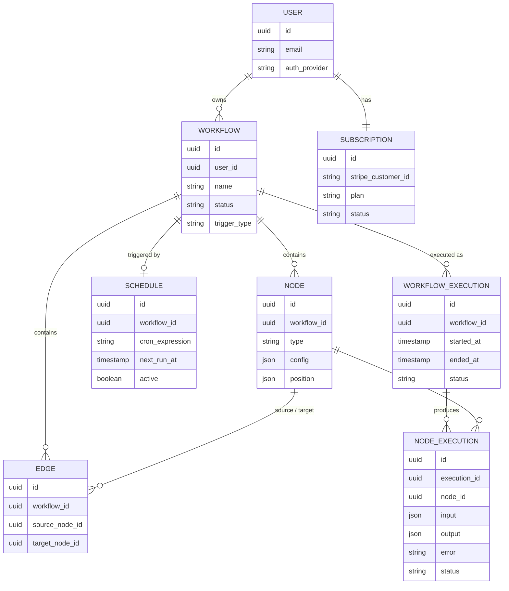

## Database Design Principles

The schema is normalized around clear ownership boundaries: workflows own their nodes, edges, and schedules, while executions own their node-level execution records. This keeps each entity's write path narrow and avoids duplicating configuration data across rows. Foreign key constraints between these entities enforce referential integrity at the database level — an edge cannot reference a node that does not belong to the same workflow, and a node execution cannot exist without a parent workflow execution — which removes an entire class of consistency checks that would otherwise need to be implemented in application code.

Separating **Workflows**, **Nodes**, and **Edges** into distinct tables, rather than storing a workflow's graph as a single serialized document, allows the Execution Engine to load exactly the data it needs to construct a DAG, and allows individual nodes to be queried, indexed, or updated independently. This matters for workflows with a large number of nodes, where loading and diffing a single monolithic document would be more expensive than a set of indexed relational lookups.

The distinction between **Workflow Executions** and **Node Executions** exists specifically to support auditability and post-hoc debugging: every run is retained as a durable record independent of the live execution context held in memory by the engine, and every node within that run has its own input, output, and error captured at the same granularity. This design also supports scalability, since execution history grows append-only over time and can be partitioned or archived independently of the workflow definitions themselves. Finally, keeping **Subscriptions** as a separate entity from **Users** isolates billing state changes — driven by Stripe webhooks — from the user record itself, so that subscription updates do not require touching authentication-related data.


- **REST** is used exclusively for communication between the frontend and the API Service. It is the only protocol the frontend speaks, regardless of which internal service ultimately fulfills the request.
- **gRPC** is used for internal, service-to-service communication. When the API Service needs to perform an operation owned by another service — such as billing — it issues a gRPC call rather than exposing that service directly to the frontend.
- **SSE** is used in the reverse direction, streaming live execution logs and status updates from the backend to the frontend without requiring the client to poll for updates.

This model keeps the frontend's integration surface limited to a single protocol (REST plus SSE), while allowing backend services to communicate through a more efficient, strongly typed protocol internally.

### API Design Principles

- **RESTful resource design** — Endpoints are organized around resources (workflows, nodes, executions, schedules) rather than actions, keeping the API surface predictable and consistent with REST conventions.
- **JWT authentication** — Protected endpoints require a valid JWT, issued at login and refreshed independently of the underlying session.
- **Stateless APIs** — The API Service holds no session state between requests; all durable state lives in PostgreSQL and Redis, allowing API instances to scale horizontally.
- **Consistent response format** — Responses follow a uniform structure across all API groups, simplifying client-side handling regardless of which resource is being accessed.
- **Input validation** — Requests are validated at the API boundary before being delegated to internal services, preventing malformed data from reaching the execution engine or database.
- **Error handling** — Errors are surfaced with consistent status codes and structured error bodies, distinguishing client errors from internal service failures.
- **Version-ready architecture** — The API is structured so that versioning can be introduced at the routing layer without requiring changes to underlying service logic.
- **Clear separation of concerns** — Each API group maps to a single responsibility and, in most cases, a single backend service, keeping request handling aligned with the platform's service boundaries.

### Request Flow Diagram

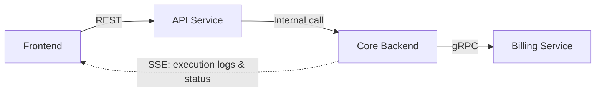


## Getting Started

This guide walks through setting up ORG locally for development. Since ORG is split across three repositories, each service must be cloned and configured independently before the full platform can run end to end.

### Prerequisites

Ensure the following are installed before proceeding:

- **Git** — required to clone the three ORG repositories.
- **Go (latest stable)** — required to build and run the core backend (`Org`) and the billing service (`org-billing-service`).
- **Node.js (LTS)** — required to run the frontend build tooling and development server.
- **npm** — used to install and manage frontend dependencies.
- **Docker** — used to run PostgreSQL, Redis, and optionally the services themselves in containers.
- **Docker Compose** — used to orchestrate the local multi-service stack (database, cache, and services) with a single command.
- **PostgreSQL** — required if running the database outside of Docker.
- **Redis** — required if running the queue/cache layer outside of Docker.

### Clone the Repositories

ORG is organized as a polyrepo. Clone each repository into your local workspace:

```bash
# Frontend
git clone https://github.com/your-org/OrgFrontend.git

# Core Backend
git clone https://github.com/your-org/Org.git

# Billing Service
git clone https://github.com/your-org/org-billing-service.git
```

### Environment Variables

Each repository includes a `.env.example` file documenting the environment variables it requires. Copy this file to `.env` within each repository and populate it with local or development values.

**Backend (`Org`)**
- `DATABASE_URL` — PostgreSQL connection string.
- `REDIS_URL` — Redis connection string.
- `JWT_SECRET` — signing secret used to issue and verify JWTs.
- `GOOGLE_CLIENT_ID` / `GOOGLE_CLIENT_SECRET` — credentials for Google OAuth login.
- `GEMINI_API_KEY` — API key used by AI-powered workflow nodes.
- `SMTP_HOST` / `SMTP_PORT` — mail server configuration for the Send Email node.
- `API_BASE_URL` — base URL the backend uses to construct webhook and callback URLs.

**Billing Service (`org-billing-service`)**
- `STRIPE_SECRET_KEY` — Stripe API key used to create checkout sessions and manage subscriptions.
- `STRIPE_WEBHOOK_SECRET` — secret used to verify incoming Stripe webhook payloads.

**Frontend (`OrgFrontend`)**
- `VITE_API_URL` — base URL of the backend API.
- `VITE_GOOGLE_CLIENT_ID` — Google OAuth client ID used by the frontend login flow.

`.env` files contain sensitive credentials and should never be committed to version control. Each repository's `.gitignore` excludes `.env` by default — only `.env.example` should be tracked.

### Install Dependencies

**Frontend**
```bash
cd OrgFrontend
npm install
```

**Backend**
```bash
cd Org
go mod tidy
```

**Billing Service**
```bash
cd org-billing-service
go mod tidy
```

### Start Development Environment

Services depend on one another at startup, so it is recommended to bring them up in the following order:

1. **PostgreSQL** — must be available before any service that persists data attempts to connect.
2. **Redis** — must be available before the backend, since it is used for execution queuing and coordination.
3. **Billing Service** — the backend communicates with this service over gRPC and expects it to be reachable during startup.
4. **Backend (`Org`)** — depends on PostgreSQL, Redis, and the Billing Service; this is the entry point for all API traffic.
5. **Frontend (`OrgFrontend`)** — depends on the backend API being available to complete authentication and load workflow data.

Starting services out of order will generally still allow them to start, but dependent services may fail their initial connection attempts until their dependencies become available. Docker Compose can be used to manage this startup order automatically for the database and cache layer.

### Access the Application

Once all services are running, the platform is available at:

- **Frontend** — `http://localhost:5173`
- **Backend API** — `http://localhost:8080`
- **Billing Service** — `http://localhost:8081`

Actual ports may differ depending on local `.env` configuration or port availability on the host machine.

### Verify the Installation

To confirm the local setup is working correctly:

- The frontend login page loads without errors.
- The backend API responds to a basic health or status request.
- A new workflow can be created and saved from the workflow builder.
- A workflow with a webhook trigger successfully registers its endpoint.
- Triggering a workflow produces live execution logs that stream to the frontend without requiring a page refresh.


## Deployment

ORG runs in production as a set of Dockerized services on a single AWS EC2 instance, fronted by Nginx. This section describes the production topology and the operational responsibilities of each component.

### Production Architecture

Incoming traffic reaches the platform through Nginx, which routes requests to the frontend or backend depending on the request path. The backend, in turn, communicates with the Billing Service over gRPC and with Redis and PostgreSQL for queuing and persistence.

```
Browser
  ↓
Nginx
  ↓
Frontend
  ↓
Backend
  ↓
Billing Service
  ↓
Redis
  ↓
PostgreSQL
```

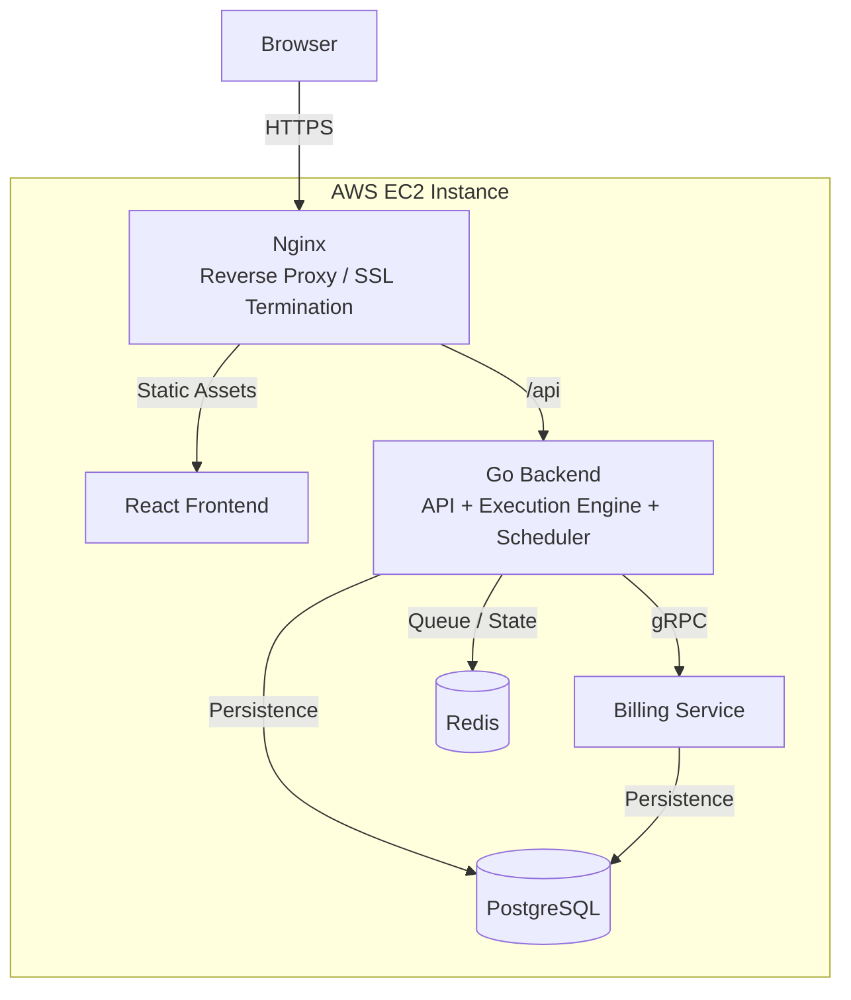

All services run on a single EC2 instance within Docker containers, coordinated by Docker Compose. Nginx is the only component directly exposed to external traffic; all other services are reachable exclusively through the internal Docker network.

### Docker

Each service — frontend, backend, and billing service — runs in its own container, built from a dedicated image and isolated from the others at the process and filesystem level. Docker Compose defines and manages the full set of containers as a single platform, handling startup order, networking, and shared configuration.

Services communicate with one another over a Docker-managed internal network rather than through the host's public interface, so inter-service traffic (gRPC calls, Redis operations, database queries) never leaves the container network. Because each service runs independently, individual containers can be restarted, rebuilt, or redeployed without requiring a restart of the entire platform, limiting the blast radius of a single service's failure or update.

### Reverse Proxy

Nginx sits in front of the platform and is the single entry point for all external traffic. Its responsibilities include:

- **SSL Termination** — Nginx terminates HTTPS connections from the browser, so backend services only need to handle plain HTTP internally.
- **Routing** — Incoming requests are routed based on path or host, directing traffic to either the frontend or the backend API.
- **API Forwarding** — Requests destined for the backend are proxied to the Go API service running in its own container, with headers and connection details preserved as needed for authentication and logging.
- **Frontend Hosting** — Static frontend assets built by the React application are served through Nginx, avoiding the need for a separate web server for static content.

### Service Communication

Production communication between components follows the same model used in development:

- **REST** — Used between the browser and the backend API for all standard client requests (authentication, workflow management, execution triggers).
- **gRPC** — Used internally between the backend and the Billing Service for subscription and plan-related operations. This traffic stays within the Docker network and is never exposed externally.
- **SSE** — Used to stream live execution logs and workflow status updates from the backend to the frontend, maintained over a long-lived HTTP connection proxied through Nginx.

### Environment Configuration

Each service is configured through environment variables supplied at container startup rather than hardcoded into the application. This includes database credentials (`DATABASE_URL`), JWT signing secrets, Stripe API keys, and Google OAuth client credentials. These values are treated as secrets: they are not committed to version control and are provided to containers through environment files or the deployment environment's secret management mechanism. Rotating a credential — such as the JWT secret or a Stripe key — only requires updating the relevant environment variable and restarting the affected container, without changes to application code.

### Production Considerations

- **Container Isolation** — Running each service in its own container limits the impact of a crash or resource spike in one service on the others.
- **Service Health** — Each service can be monitored and restarted independently, allowing a failing container (for example, the Billing Service) to be recovered without taking down the frontend or backend.
- **Persistent Database Storage** — PostgreSQL data is stored on a persistent volume outside the container's writable layer, ensuring data survives container restarts or rebuilds.
- **Redis Persistence** — Redis is configured with persistence appropriate to its role as a queue and short-lived state store, balancing durability against the transient nature of most of the data it holds.
- **Scalability** — While the current deployment runs all services on a single EC2 instance, the containerized, service-oriented design allows individual services — particularly the backend and Billing Service — to be moved to separate hosts or scaled horizontally as load increases, without changes to how services communicate with one another.


The backend accepts the trigger, enqueues the execution, and returns a response without waiting for the workflow to complete. Execution then proceeds independently, with status and logs made available as the run progresses. This keeps the API responsive regardless of how long a given workflow takes to run, and ensures that a slow or long-running workflow does not block the request-handling path for unrelated users.

### Redis-backed Processing

Redis is used to coordinate workflow execution, hold temporary execution state, and support asynchronous processing between the backend and the execution engine. Its in-memory design provides low-latency read and write operations, which suits the short-lived, frequently updated nature of execution coordination data far better than a durable relational store would. By handling this transient layer separately from PostgreSQL, ORG keeps its primary datastore focused on durable, long-lived records while Redis absorbs the higher-churn operational data generated during execution.

### Efficient Service Communication

ORG uses different communication protocols depending on the nature of the interaction:

**REST**
Used for all communication between the frontend and the backend. Its request/response model fits the way the frontend interacts with the API — fetching data, submitting forms, and triggering actions.

**gRPC**
Used for communication between the Core Backend and the Billing Service. gRPC's use of strongly typed contracts and binary serialization reduces overhead compared to REST for internal calls, and enforces a well-defined interface between the two services that changes in a controlled, versionable way.

### Real-Time Execution Monitoring

Execution logs and status updates are streamed to the frontend using Server-Sent Events rather than delivered through repeated polling. This allows the frontend to receive updates as soon as they occur, without the overhead of the client repeatedly issuing requests to check for changes. The result is both a lighter load on the backend and a more immediate, accurate view of execution progress for the user.

### Containerized Deployment

Every major component of ORG — the React frontend, the Core Backend, the Billing Service, PostgreSQL, and Redis — runs inside its own Docker container. This gives each service a consistent, reproducible runtime environment regardless of where it is deployed, and isolates it from the others at the process and dependency level. Containers can be started, stopped, or restarted independently, allowing individual services to be managed or updated without requiring a full platform restart.

### Reliable Data Storage

PostgreSQL is the primary datastore for ORG and holds all durable platform data: users, workflows, nodes, edges, executions, schedules, and subscription metadata. Using a single relational datastore for these related entities allows referential integrity to be enforced directly at the database level, and ensures that execution history remains available for inspection independently of the live state held by the execution engine at runtime.

### Current Scalability Characteristics

The current architecture provides:

- A microservices architecture separating core workflow logic from billing.
- Stateless APIs that do not depend on in-memory session state.
- Redis-backed asynchronous execution, decoupling triggers from execution completion.
- Dockerized services with consistent, isolated runtime environments.
- An independently deployable Billing Service.
- Real-time execution monitoring via SSE rather than polling.
- gRPC-based communication between backend services.
- Workflow execution that is separated from the API request lifecycle.

### Future Improvements

The following are potential directions for future work and are **not** part of the current implementation:

- Horizontal scaling of backend service instances.
- Support for multiple concurrent workflow execution workers.
- Kubernetes-based deployment and orchestration.
- PostgreSQL replication for read scaling and availability.
- Redis high availability configurations.
- Metrics and observability tooling for runtime insight into service health.
- A distributed scheduler capable of coordinating across multiple instances.

### Architecture Diagram

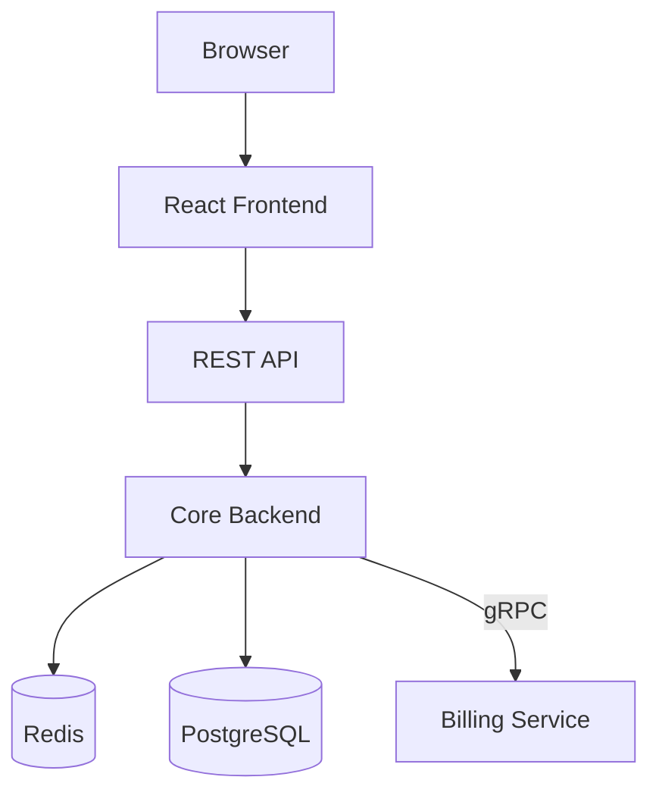


## Security

Security in ORG is addressed at multiple layers of the system — authentication, API access, service communication, and infrastructure — rather than relying on any single mechanism. This section describes the security measures currently implemented in the platform.

### Authentication

ORG uses JSON Web Tokens (JWT) as the primary authentication mechanism for API access. Upon successful login, a signed token is issued to the client and included with subsequent requests to identify the authenticated user. The backend validates each token's signature and claims before allowing a request to proceed, ensuring that only requests bearing a valid, unexpired token can reach protected functionality. API endpoints that operate on user-specific data — workflows, nodes, executions, schedules, and billing — are gated behind this authentication check.

### OAuth Integration

In addition to standard authentication, ORG supports login via Google OAuth. This allows users to authenticate using their existing Google account through Google's standard authorization flow, rather than ORG handling and storing a password directly for those accounts. On successful authentication, the resulting identity is linked to the corresponding user account within ORG, allowing OAuth-based and credential-based sessions to resolve to the same underlying user record.

### API Security

Protected API routes are guarded by authentication middleware that verifies the caller's JWT before any handler logic executes. This middleware enforces route protection consistently across the API, rather than requiring each individual endpoint to implement its own authentication check. Beyond authentication, authorization checks ensure that a user can only access or modify resources — workflows, nodes, schedules — that belong to their own account. Incoming request payloads are validated before being processed, reducing the likelihood of malformed or unexpected data reaching business logic or the database layer.

### Webhook Security

Each workflow with a webhook trigger is assigned a unique, generated endpoint rather than a shared or predictable URL. This means a workflow can only be triggered by a request sent to its specific endpoint, preventing one workflow's trigger from being invoked through another's. Access to trigger a workflow via webhook is scoped to knowledge of that unique endpoint, keeping workflow triggering controlled without exposing a general-purpose execution endpoint.

### Payment Security

Payment collection is handled entirely through Stripe Checkout, meaning ORG does not directly process or store cardholder data — sensitive payment details are handled within Stripe's hosted flow. Incoming Stripe webhook events, which the Billing Service relies on to update subscription state, are verified using a webhook signing secret before being processed, ensuring that subscription and billing state are only updated in response to authenticated events originating from Stripe.

### Secret Management

Sensitive configuration values — including JWT signing secrets, Google OAuth client credentials, Stripe API keys, and database connection strings — are supplied to each service through environment variables rather than being hardcoded into the application. These values are kept out of source control entirely; each repository tracks only an `.env.example` file documenting the required variables, while actual `.env` files containing real credentials are excluded from version control. This keeps secret rotation a configuration-level change rather than a code change.

### Infrastructure Security

Each service in ORG — frontend, backend, billing service, PostgreSQL, and Redis — runs in its own Docker container, isolating its process space and dependencies from the other services on the same host. External traffic is routed through Nginx, which acts as the platform's single point of entry and handles HTTPS termination where SSL is configured, so that internal services communicate over plain HTTP within the isolated container network rather than being individually exposed to the public internet.

### Security Principles

ORG's security model is guided by the following principles:

- **Least privilege** — Users and authenticated sessions can only access and modify resources they own.
- **Secure defaults** — Protected endpoints require authentication by default rather than being opt-in.
- **Separation of concerns** — Authentication, authorization, payment handling, and infrastructure security are each addressed at the layer responsible for them, rather than being conflated into a single mechanism.
- **Defense in depth** — Security is enforced at multiple layers — middleware, service boundaries, and infrastructure — so that no single control is solely responsible for protecting the system.
- **Secure credential management** — Secrets are provided through environment configuration and never committed to source control, keeping sensitive values out of the codebase entirely.


## Engineering Challenges & Learnings

Building ORG involved a series of design and implementation decisions that were not always obvious upfront. This section documents the most significant challenges encountered during development, the reasoning behind the decisions made, and the lessons drawn from working through them.

### Building the Workflow Engine

Representing a workflow as a directed graph was one of the earliest design decisions, and one that shaped much of what followed. Nodes and edges needed a data model expressive enough to support branching and parallel paths, while still being simple enough to load and traverse efficiently at execution time. Determining execution order required constructing a dependency graph from stored nodes and edges and resolving it topologically, ensuring that a node only executes once all of its parents have completed.

Handling branching logic introduced additional complexity: a condition node's output determines which downstream path, if any, should execute, which meant the engine needed to track not just whether a node had run, but whether it was reachable at all given the outcomes of upstream nodes. Tracking execution state at both the workflow level and the individual node level required a state model that could represent partial progress — some nodes complete, others still running, others waiting — without ambiguity. The main lesson from this part of the project was that a graph-based execution model needs its state machine defined precisely before implementation begins; retrofitting state tracking after execution logic is already in place is significantly harder than designing for it from the start.

### Designing a Microservices Architecture

Splitting ORG into a core backend and a separate billing service required deciding where the true boundary between services should sit. The billing service was a natural candidate for separation since its responsibilities — Stripe integration, subscription state, plan validation — are largely independent of workflow execution, and isolating it meant that billing-related issues would not directly affect the execution path.

Choosing gRPC for communication between the two services meant defining explicit contracts up front, which added initial overhead compared to calling an internal function directly, but paid off in keeping the interface between services well-defined and versionable. Keeping the services loosely coupled required resisting the temptation to share database access or internal types between them; each service was scoped to own its own data and expose only what was necessary through its gRPC interface. This reinforced a general lesson: service boundaries are only meaningful if they are enforced consistently, not just declared in an architecture diagram.

### Real-Time Execution Monitoring

Early versions of execution monitoring relied on the frontend polling for status updates, which was simple to implement but introduced unnecessary load and delay in reflecting execution progress. Server-Sent Events were adopted specifically to address this: they allowed the backend to push execution logs and status changes to the frontend as they occurred, over a single long-lived connection, without the client needing to repeatedly ask whether anything had changed.

Implementing SSE required rethinking how the backend surfaced execution updates internally, since log and status events needed to be emitted incrementally as the workflow engine processed each node, rather than only being available once a run completed. This shift from a request/response mindset to a streaming mindset was one of the more valuable adjustments made during the project.

### Authentication and Billing

Integrating JWT authentication alongside Google OAuth required handling two distinct authentication paths that needed to converge on the same underlying user model. Ensuring that a user who signed up with a password and a user who logged in via Google could be treated consistently by the rest of the system took careful handling of account linking and token issuance.

Stripe integration introduced its own set of lessons, particularly around webhook handling. Subscription state needed to be updated reliably in response to asynchronous events from Stripe rather than assumed at the time of checkout, which meant the billing service had to be built around eventual consistency between Stripe's records and ORG's own database, rather than treating a successful checkout call as the final source of truth.

### Deploying to Production

Moving from local development to a production deployment on AWS EC2 surfaced issues that were not visible during local testing. Dockerizing each service clarified dependencies that had previously been implicit, since each container needed to declare exactly what it required to run. Configuring Nginx as a reverse proxy in front of the frontend and backend required getting routing and connection handling right for both standard HTTP requests and long-lived SSE connections, which behave differently under a proxy than typical request/response traffic.

Environment variable management became more important in production than in development, since misconfigured or missing values surfaced as runtime failures rather than immediate startup errors. Debugging issues in this environment — without the immediate feedback loop of a local development setup — reinforced the importance of clear logging and of verifying configuration before assuming a deeper bug in the application logic.

### Context Engineering

ORG was built primarily using free-tier AI tools, which came with real constraints: limited context windows and usage limits meant that large, loosely defined problems could not simply be handed over in full and solved in one pass. This limitation shaped how work was approached — problems had to be broken down into smaller, well-scoped pieces before being tackled, and maintaining clear architecture documentation became necessary just to keep each piece consistent with the overall system design.

Organizing prompts and managing context effectively became a skill in its own right, distinct from writing code or designing systems. Deciding what context was relevant to a given problem, and what could be safely omitted, often determined whether a session with an AI tool produced a usable result or not. This experience reinforced that working effectively within constraints — clearly defining a problem, providing the right context, and knowing what to ask for — is often more valuable than access to a larger model. At every stage, architectural decisions, debugging, testing, and final implementation remained the developer's responsibility; AI tools were used as an aid within a process that still required the same engineering judgment as building the system without them.

### Key Takeaways

Building ORG reinforced a number of lessons that extend beyond any single technology used:

- Designing a production-style system requires thinking about state, failure modes, and boundaries before writing implementation code, not after.
- Maintainable software depends more on clear separation of responsibilities than on any individual technology choice.
- Approaching a project in terms of architecture — data model, service boundaries, execution semantics — produces more durable decisions than approaching it feature by feature.
- Most significant engineering decisions involve trade-offs rather than clearly correct answers, and being explicit about those trade-offs makes them easier to revisit later.
- Working through deployment and production issues directly improved debugging skills in ways that local development alone does not.
- Clear documentation and deliberate context management are not incidental to engineering work — they directly affect how efficiently and correctly a system can be built, especially under real constraints.


## Roadmap

This roadmap reflects the current state of ORG and the direction planned for future development. It is intended to give contributors and users an honest view of what is implemented today versus what is planned, without committing to specific timelines.

### Completed

- [x] Visual Workflow Builder
- [x] React Flow Editor
- [x] Workflow Deployment
- [x] Workflow Execution Engine
- [x] DAG-based Execution
- [x] Webhook Trigger
- [x] Cron Trigger
- [x] AI Node (Google Gemini)
- [x] HTTP Request Node
- [x] Delay Node
- [x] Condition Node
- [x] Email Node
- [x] Workflow Variables
- [x] Live Execution Logs
- [x] Execution History
- [x] Google OAuth
- [x] JWT Authentication
- [x] Stripe Billing
- [x] Docker Deployment
- [x] AWS Hosting
- [x] gRPC Microservices
- [x] PostgreSQL Persistence
- [x] Redis-backed Queuing

### In Progress

- [ ] Improved execution monitoring (richer status detail beyond current logs)
- [ ] Better node configuration UX in the workflow builder
- [ ] General workflow builder refinements and usability improvements

### Planned

- [ ] Slack Integration
- [ ] WhatsApp Integration
- [ ] Discord Integration
- [ ] Microsoft Teams Integration
- [ ] Telegram Integration
- [ ] Workflow Templates
- [ ] Team Workspaces
- [ ] Template Marketplace
- [ ] Workflow Versioning
- [ ] Folder Organization
- [ ] Public API
- [ ] API Keys
- [ ] Custom Nodes
- [ ] Plugin SDK
- [ ] Role-Based Access Control (RBAC)
- [ ] Webhook Management (viewing, regenerating, and disabling endpoints)
- [ ] Workflow Import/Export
- [ ] CLI
- [ ] Audit Logs
- [ ] Notification Center

### Long-Term Vision

The following are long-term architectural and product goals rather than near-term commitments. They represent the direction ORG could grow toward as the platform and its user base mature:

- **Multi-tenant architecture** — supporting isolated organizations or workspaces within a single deployment.
- **Kubernetes deployment** — moving from a single-host Docker Compose setup to orchestrated, container-managed infrastructure.
- **Worker scaling** — running multiple workflow execution workers to increase execution throughput.
- **Distributed execution** — coordinating workflow execution across multiple nodes rather than a single backend instance.
- **Marketplace ecosystem** — enabling users to share and discover workflow templates and custom nodes.
- **Community plugins** — allowing third-party developers to extend ORG's node system through a plugin interface.
- **Enterprise features** — including RBAC, audit logging, and workspace-level administration suited to larger organizations.

These items depend on architectural work — particularly around multi-tenancy and distributed execution — that has not yet begun, and are included here to communicate direction rather than current or imminent scope.


